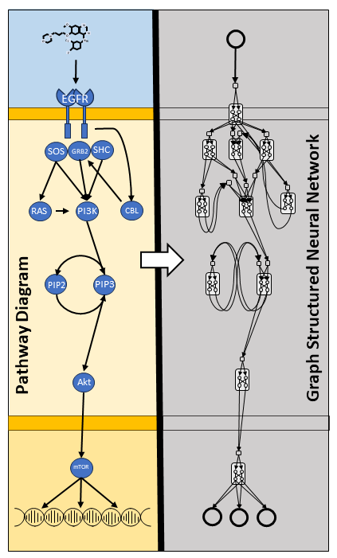

# Graph Structured Neural Networks (GSNN)



Author: Nathaniel Evans   
Contact: evansna@ohsu.edu

Computational modeling of perturbation biology identifies relationships between molecular elements and cellular response, and an accurate understanding of these systems will support the full realization of precision medicine. Traditional deep learning, while often accurate in predicting response, is unlikely to capture the true sequence of involved molecular interactions. Our work is motivated by two assumptions: 1) Methods that encourage mechanistic prediction logic are likely to be more trustworthy, and 2) problem-specific algorithms are likely to outperform generic algorithms. We present an alternative to Graph Neural Networks (GNNs) termed Graph Structured Neural Networks (GSNN), which uses cell signaling knowledge, encoded as a graph data structure, to add inductive biases to deep learning. We apply our method to perturbation biology using the LINCS L1000 dataset and literature-curated molecular interactions. We demonstrate that GSNNs outperform baseline algorithms in several prediction tasks, including 1) perturbed expression, 2) cell viability of drug combinations, and 3) disease-specific drug prioritization. We also present a method called GSNNExplainer to explain GSNN predictions in a biologically interpretable form. This work has broad application in basic biological research and pre-clincal drug repurposing. Further refinement of these methods may produce trustworthy models of drug response suitable for use as clinical decision aids.

## Citation 

```
@article {Evans2024.02.28.582164,
	author = {Nathaniel J. Evans and Gordon B. Mills and Guanming Wu and Xubo Song and Shannon McWeeney},
	title = {Graph Structured Neural Networks for Perturbation Biology},
	elocation-id = {2024.02.28.582164},
	year = {2024},
	doi = {10.1101/2024.02.28.582164},
	publisher = {Cold Spring Harbor Laboratory},
	URL = {https://www.biorxiv.org/content/early/2024/02/29/2024.02.28.582164},
	eprint = {https://www.biorxiv.org/content/early/2024/02/29/2024.02.28.582164.full.pdf},
	journal = {bioRxiv}
}
```

## Getting Started

Create the `conda/mamba` python environment: 
```bash 
$ mamba env create -f environment.yml 
$ conda activate gsnn 
(gsnn) $
```

Download the necessary raw data: 
```bash 
$ ./get_data.sh /path/to/download/dir/
```

Process and save data appropriate for modeling: 
```bash 
(gsnn) $ python make_data.py --data /path/to/download/dir/ --out /path/to/processed/dir/ --pathways R-HSA-9006934 --feature_space landmark best-inferred --targetome_targets
```

Train models: 
```bash 
(gsnn) $ python train_gsnn.py --data /path/to/processed/dir/ --fold /path/to/data/partitions/dir/ --out /path/to/output/ 

(gsnn) $ python train_gnn.py --data /path/to/processed/dir/ --fold /path/to/data/partitions/dir/ --out /path/to/output/ 

(gsnn) $ python train_nn.py --data --data /path/to/processed/dir/ --fold /path/to/data/partitions/dir/ --out /path/to/output/
```

> NOTE: use ```$ python <fn> --help``` to get optional command line arguments. 

## Manuscript Figures 

See the `jupyter notebooks` in `./notebooks/` for the scripts used to generate all figures in manuscript. For more information, contact: evansna@ohsu.edu. 
