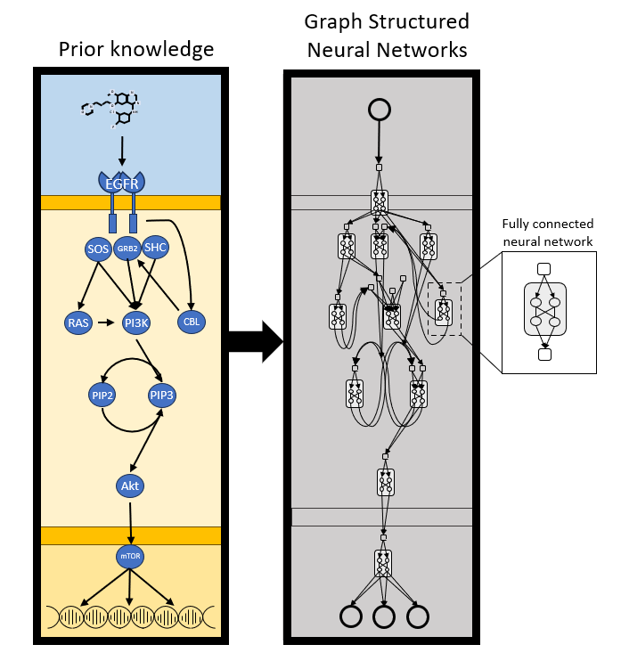

Introduction
============

What is GSNN?
-------------

**Graph Structured Neural Networks (GSNN)** is a novel approach that incorporates prior knowledge of latent variable interactions directly into neural network architecture. Unlike traditional neural networks that learn relationships from data alone, GSNN leverages domain-specific knowledge to guide the learning process, making it particularly powerful for applications in perturbation biology and other domains where prior knowledge about variable relationships is available.

The GSNN method was introduced in the paper "Graph Structured Neural Networks for Perturbation Biology" (Evans et al., 2024) and provides a framework for building interpretable, structured neural networks that respect known biological or domain relationships.

Key Concepts
-----------

**Prior Knowledge Integration**
    GSNN allows you to encode domain-specific knowledge about how variables interact through a graph structure. This graph defines which variables can directly influence each other, constraining the neural network to learn only biologically or physically plausible relationships.

**Three-Node Architecture**
    GSNN uses a specialized three-node type architecture:
    
    - **Input nodes**: Represent observed variables
    - **Function nodes**: Represent latent variables
    - **Output nodes**: Represent target variables

**Sparse Connectivity**
    The connections between nodes are sparse and determined by your prior knowledge graph, leading to more interpretable models and better generalization, especially in data-limited scenarios.

**Perturbation Biology Applications**
    GSNN is particularly well-suited for perturbation biology studies where you want to understand how interventions (perturbations) affect biological systems. The graph structure can encode known biological pathways, protein-protein interactions, or regulatory networks.

Why Use GSNN?
-------------

**Interpretability**
    Unlike black-box neural networks, GSNN models are interpretable because the learned weights correspond to specific relationships in your prior knowledge graph. You can directly examine which connections are important for predictions.

**Data Efficiency**
    By incorporating prior knowledge, GSNN can learn meaningful relationships from smaller datasets than would be required for traditional neural networks.

**Domain Knowledge Respect**
    GSNN ensures that your model respects known biological or physical constraints, preventing it from learning spurious correlations that violate domain knowledge.

**Flexible Architecture**
    GSNN supports various normalization strategies, activation functions, and can be combined with advanced techniques like uncertainty quantification, reinforcement learning, and Bayesian optimization.

Core Features
------------

**Graph-Based Architecture**
    - Define custom graph structures representing your domain knowledge
    - Automatic handling of sparse connectivity patterns

**Training Options**
    - Gradient checkpointing for memory efficiency
    - Multiple normalization strategies (Layer, Batch)
    - Residual connections to improve training stability
    - Support for various activation functions and weight initialization strategies

**Optimization and Inference**
    - Reinforcement learning or Bayesian optimization for graph structure optimization
    - Uncertainty quantification through hypernetworks'
    - Weight pruning to improve inference speeds and model size 

**Interpretation Tools**
    - Model explanation and visualization (GSNNExplainer)
    - Entity function extraction

How are GSNNs different from graph neural networks?
-------------------------------------------------

While both GSNNs and Graph Neural Networks (GNNs) use graphs, they serve fundamentally different purposes and operate in distinct ways:

**GNNs: Learning from Graph Structure**
    Traditional GNNs treat the graph as data to learn from. They use permutation-invariant aggregation functions to learn local patterns and node representations and can often generalize to new, unseen graphs.

**GSNNs: Constraining with Graph Structure**
    GSNNs use the graph structure as a constraint mechanism rather than learning target. The graph defines which variables can directly influence each other, applying inductive biases through feature constraints. GSNNs are transductive—they are trained on a single graph and cannot be applied to new graphs. 

**Key Distinction**
    This distinction is critical when choosing between approaches. In biological signaling, for example, similar local network structures may produce drastically different signaling patterns. While the network structure is useful for understanding causal interactions, the graph patterns themselves are not necessarily predictive of signaling behaviors. GSNNs leverage this domain knowledge to constrain the model architecture, while GNNs are likely to try to map similar local graph structures to signaling patterns.

Getting Started
--------------

The GSNN library provides comprehensive tutorials to help you get started:

- **Basic Usage**: Learn to build and train your first GSNN model
- **Simulation**: Use bayesian networks to generate synthetic data
- **Comparison**: Compare GSNN performance against baseline methods
- **Advanced Features**: Explore reinforcement learning, Bayesian optimization, and uncertainty quantification

Installation
-----------

Create the conda/mamba environment and install GSNN:

.. code-block:: bash

   mamba env create -f environment.yml
   conda activate gsnn
   pip install -e .

Citation
--------

If you use GSNN in your research, please cite:

.. code-block:: text

   @article{Evans2024.02.28.582164,
       author = {Nathaniel J. Evans and Gordon B. Mills and Guanming Wu and Xubo Song and Shannon McWeeney},
       title = {Graph Structured Neural Networks for Perturbation Biology},
       elocation-id = {2024.02.28.582164},
       year = {2024},
       doi = {10.1101/2024.02.28.582164},
       publisher = {Cold Spring Harbor Laboratory},
       URL = {https://www.biorxiv.org/content/early/2024/02/29/2024.02.28.582164},
       journal = {bioRxiv}
   }

Next Steps
----------

- Explore the :doc:`../tutorials/index` for hands-on examples
- Check out the :doc:`../api/index` for detailed API documentation
- Visit the `GitHub repository <https://github.com/nathanieljevans/GSNN>`_ for the latest updates and issues

