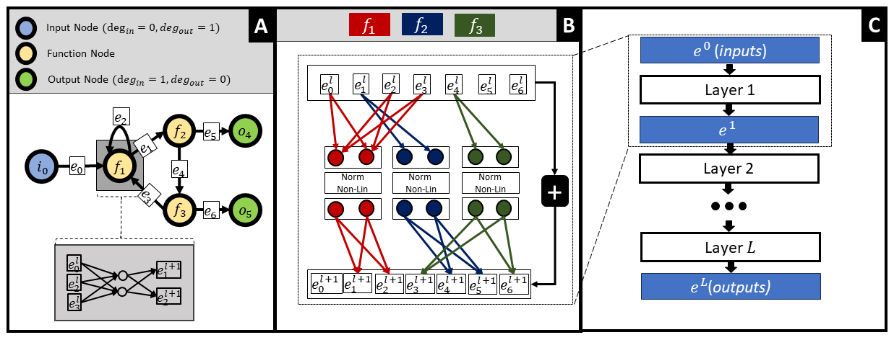

Methods
=======

Graph Structured Neural Network (GSNN)
--------------------------------------

Graph Structured Neural Networks (GSNN) were originally designed to model biological signaling networks by **constraining** a neural network with the structure described by a user-defined *graph* :math:`\mathcal{G}`.  The graph encodes the molecular entities (*nodes*) and their interactions (*edges*), thereby defining which variables may directly influence each other during learning. The GSNN architecture is best conceptualized of as univariate edge features that are transformed over sequential layer operations. The transformations are constrained by the user-defined graph and the function nodes learn relationships between input and output edges. This approach effectively handles cyclic graphs and can scale to deep networks able to propagate information long distances through the graph.  

The architecture employs three types of nodes:

* **Input nodes** – observed variables
* **Function nodes** – latent variables parameterised by neural networks
* **Output nodes** – target variables

Only *function nodes* are trainable; input and output nodes pass/receive information through the network unchanged.

A toy example demonstrating how any given graph structure can be formulated as a feed-forward neural network with sparse weight matrices. Each yellow node in the left graph represents a fully-connected one-layer neural network with two hidden channels (function nodes). Panel A shows the structural graph (:math:`\mathcal{G}`) that constrains the GSNN model, while panel B depicts how edge latent values (:math:`e_i`) are updated in a single forward pass. Sparse weight matrices omit nonexistent edges, and the ⊕ symbol indicates a residual connection from the previous layer.

.. raw:: html

    
   
.. note::
    Unlike GNNs, where latent representations typically characterize the state of a *node*, GSNN latent representations characterize the state of an *edge*. This allows the GSNN method to learn nonlinear multivariate relationships between input edges and output edges and still be applicable to cyclic graphs.

Function Nodes
^^^^^^^^^^^^^^
Each function node :math:`f_n` is implemented as a small fully-connected feed-forward network whose shape is determined by the local topology of :math:`\mathcal{G}`:

* **Inputs**  – equal to the in-degree of node *n*
* **Outputs** – equal to the out-degree of node *n*
* **Hidden channels / layers** – user-defined hyper-parameters. While GSNN could theoretically use multi-layer neural networks to parameterize function nodes, we have found that single-layer networks are sufficient for most applications and currently do not support multi-layer networks.

.. note::
    To avoid confusion, we use the term *layer* to refer to the number of sequential sparse linear layers that propagate information across the entire graph. The neural networks that parameterize function nodes are fixed to a single layer.

Layer Updates with Masked Linear Layers
^^^^^^^^^^^^^^^^^^^^^^^^^^^^^^^^^^^^^^^
A single GSNN layer updates **edge** representations via a *sparse linear operation*.  The weight matrix has shape :math:`(E, N \times C)` where

* :math:`E` – number of edges in :math:`\mathcal{G}`
* :math:`N` – number of function nodes
* :math:`C` – hidden channels per function node

.. note::
    There is **no parameter sharing** between function nodes—each learns a distinct mapping from its inputs to its outputs. That said, parameters can optionally be shared across layers.

Iterating the update *L* times enables information to travel a path length of *L* across the input graph.

Sparse Implementation
^^^^^^^^^^^^^^^^^^^^^
A dense implementation of the masked matrices would quickly exhaust memory on realistic graphs.  Instead, GSNN stores the matrices as **sparse tensors**, reducing both memory and compute.  The current PyTorch sparse backend is not optimised for mini-batching, so GSNN leverages **PyTorch Geometric** for fast batched sparse matrix multiplication, especially on GPUs.

Residual Connections & Normalisation
^^^^^^^^^^^^^^^^^^^^^^^^^^^^^^^^^^^^
GSNN is [optionally] a residual architecture where the layer output is added to its input:

.. math::

   x_{l+1} = F(x_l) + x_l

Residual connections allow the model to learn *edge latency*—the temporal lag between upstream and downstream signals—and alleviate vanishing gradients in deep networks.

* **Normalisation** – We provide several normalization options:
    * **None** – No normalization is applied.
    * **Batch** – Batch normalization is applied to the entire graph. This approach works well for large batches and is applicable to small channel sizes.
    * **Layer** – Layer normalization is applied within each function node. This approach works well for small batches with large channel sizes. 
    * **Softmax** – Softmax normalization is applied to the entire graph.
* **Self-edges** – Optional self-connections let a node incorporate its previous-layer state.
* **Parameter sharing** – While GSNN supports weight sharing across layers, empirical results typically show better performance when each layer has its own parameters.

Weight Initialisation
^^^^^^^^^^^^^^^^^^^^^
GSNN offers both **Kaiming/He** and **Xavier/Glorot** initialisation adapted to the graph setting.  Let :math:`D_i^{in}` and :math:`D_i^{out}` be the in- and out-degree of function node *i* in :math:`\mathcal{G}`.  Then

.. math::

   w^{\text{kaiming}}_i &\sim \mathcal{N}\!\bigl(0, \tfrac{2}{D_i^{in}}\bigr) \\
   w^{\text{xavier}}_i  &\sim \mathcal{N}\!\bigl(0, \tfrac{2}{D_i^{in}+D_i^{out}}\bigr)

Using degree-aware fan-in/out preserves the variance of activations despite the sparse, non-uniform connectivity.

Efficient Mini-Batching
^^^^^^^^^^^^^^^^^^^^^^
PyTorch's native sparse operations remain slow for large batches.  GSNN therefore reformulates the masked linear layers as a **PyTorch Geometric graph convolution**, gaining substantial speed-ups during training and inference—particularly on GPUs.

Gradient Checkpointing
^^^^^^^^^^^^^^^^^^^^^^

To reduce memory usage, GSNN supports **gradient checkpointing** at each layer, which substantially reduces memory usage at the cost of some compute.

GSNNExplainer
--------------

GSNNs are interpretable by construction—each weight corresponds to a *specific* interaction in the prior knowledge graph—but a  This approach is inspired by [GNNExplainer](https://arxiv.org/abs/1903.03894). 

Conceptually, GSNNExplainer asks the following question: *“Which edges must be present for the GSNN to make the same prediction for this sample?”*  Starting from the trained model it learns a binary mask :math:`\mathbf{m}\in\{0,1\}^{E}` that switches edges on or off during the forward pass.  The mask is found by solving

.. math::
   \underset{\mathbf{m}}{\operatorname*{arg\,min}}\; \bigl\| f_{\mathbf{m}}(\mathbf{x}) - f(\mathbf{x}) \bigr\|_2^2 \; + \; \beta\,\lVert \mathbf{m} \rVert_1,

where :math:`f_{\mathbf{m}}` denotes the masked GSNN and the :math:`\ell_1` term encourages sparsity.  Following Ying *et al.* (2019) we relax the discrete mask with a **Gumbel-Softmax** distribution so the objective is optimised end-to-end with standard SGD.

Key adaptations for GSNN
^^^^^^^^^^^^^^^^^^^^^^^^
• **Edge-centric explanations** – Because GSNN latent variables live on edges, the explainer manipulates *edge* activations rather than node embeddings.

• **Baseline comparisons** – Optionally, a user can provide a reference input :math:`\mathbf{x}_b` (e.g. an unperturbed control).  The explainer then targets the *difference* :math:`f(\mathbf{x})-f(\mathbf{x}_b)`, ensuring the extracted sub-graph highlights edges responsible for the observed change rather than global structure.

• **Parsimony control** – The hyper-parameter :math:`\beta` (default 1) trades explanation fidelity for compactness.  Smaller values yield larger sub-graphs; larger values isolate only the most influential interactions.

Practical use
^^^^^^^^^^^^^
In practice a few hundred optimisation steps with Adam are sufficient.  The output is a ranked edge list that can be visualised directly on the input graph, allowing researchers to trace the signalling routes that drive a specific phenotype or perturbation response.

We find that GSNNExplainer typically selects 5–15 % of edges while preserving >95 % of the original predictive accuracy, providing a concise yet mechanistically meaningful summary of the model’s reasoning.

